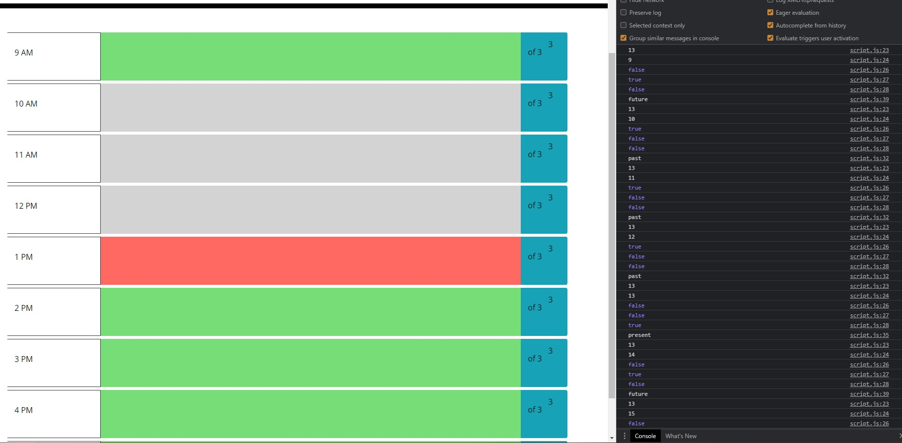
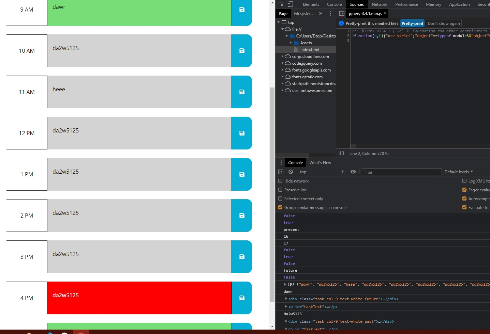

# Work Day Scheduler Starter Code

## Acceptance Criteria 

GIVEN I am using a daily planner to create a schedule
WHEN I open the planner
THEN the current day is displayed at the top of the calendar
WHEN I scroll down
THEN I am presented with time blocks for standard business hours
WHEN I view the time blocks for that day
THEN each time block is color-coded to indicate whether it is in the past, present, or future
WHEN I click into a time block
THEN I can enter an event
WHEN I click the save button for that time block
THEN the text for that event is saved in local storage
WHEN I refresh the page
THEN the saved events persist

### Bugs

For reasons unknown the time-block for 9 AM will ALWAYS be color coded as a future event.
I have attached console logging of the variables and booleans used 
to determine if each individual time-block is in the present, future, or past.
  
In the below screenshot: 
js:23 prints the current-time in 24h format, let n = this value 
js:24 prints the time stamp of the time-block, let m = this value 
js:26 returns n>m 
js:27 returns m>n 
js:28 returns n=m 
 
As you can see, even when the current time is larger than 9, js:26 still returns a value of false while js:27 returns a value of true

I have no idea why this happens. I have logging all throughout my auditTasks function, please take a look at wtf I'm doing wrong.

### Other Screenshots

Note the array of strings in the console, which is reflected on the webpage itself  

#### Special Thanks

